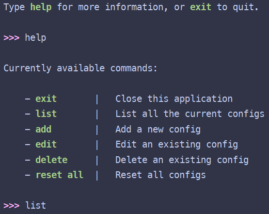

# Key Remap

There are 2 versions of the application:

- Graphical User Interface (GUI)

<div style="text-align: center">
    
</div>

- Command-line Interface (CLI)

<div style="text-align: center">
    
</div>

## Install

> **Note**:
> With GUI, you can directly run the `key_remap.exe` file without doing anything further

Firstly, clone this repo. Then, choose the version that you prefer and run the command below

### GUI version

```bash
pip install .[gui]
```

### CLI version

```bash
pip install .[cli]
```

## Start the application

### GUI version

Run the `key-remap.exe` or the command below:

```bash
key-remap-gui
```

### CLI version

```bash
key-remap
```