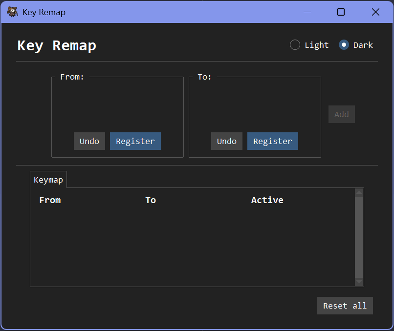
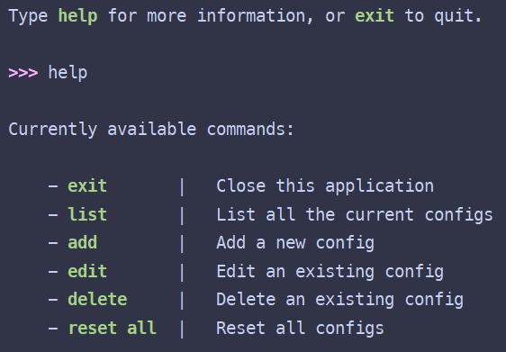

# Key Remap

There are 2 versions of the application:

- Graphical User Interface (GUI)

<p align="center">
    
</p>

- Command-line Interface (CLI)

<p align="center">
    
</p>

## Install

> **Note**:
>
> With GUI, you can directly run the `key_remap.exe` file without doing anything further.
> (Downloadable at [GitHub Releases](https://github.com/lpun-majessica/key_remap/releases) by clicking on the file)

Firstly, clone this repo. Then, choose the version that you prefer and run the command below

### GUI version

```bash
pip install .[gui]
```

### CLI version

```bash
pip install .[cli]
```

## Start the application

### GUI version

Run the `key-remap.exe` or the command below:

```bash
key-remap-gui
```

### CLI version

```bash
key-remap
```